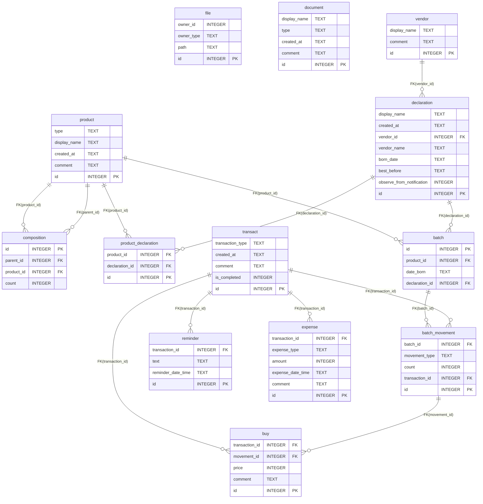

```mermaid
erDiagram
file {
  owner_id INTEGER
  owner_type TEXT
  path TEXT
  id INTEGER PK
}

document {
  display_name TEXT
  type TEXT
  created_at TEXT
  comment TEXT
  id INTEGER PK
}

vendor {
  display_name TEXT
  comment TEXT
  id INTEGER PK
}

declaration {
  display_name TEXT
  created_at TEXT
  vendor_id INTEGER FK
  vendor_name TEXT
  born_date TEXT
  best_before TEXT
  observe_from_notification INTEGER
  id INTEGER PK
}

product {
  type TEXT
  display_name TEXT
  created_at TEXT
  comment TEXT
  id INTEGER PK
}

composition {
  id INTEGER PK
  parent_id INTEGER FK
  product_id INTEGER FK
  count INTEGER
}

product_declaration {
  product_id INTEGER FK
  declaration_id INTEGER FK
  id INTEGER PK
}

batch {
  id INTEGER PK
  product_id INTEGER FK
  date_born TEXT
  declaration_id INTEGER FK
}

batch_movement {
  batch_id INTEGER FK
  movement_type TEXT
  count INTEGER
  transaction_id INTEGER FK
  id INTEGER PK
}

transact {
  transaction_type TEXT
  created_at TEXT
  comment TEXT
  is_completed INTEGER
  id INTEGER PK
}

buy {
  transaction_id INTEGER FK
  movement_id INTEGER FK
  price INTEGER
  comment TEXT
  id INTEGER PK
}

reminder {
  transaction_id INTEGER FK
  text TEXT
  reminder_date_time TEXT
  id INTEGER PK
}

expense {
  transaction_id INTEGER FK
  expense_type TEXT
  amount INTEGER
  expense_date_time TEXT
  comment TEXT
  id INTEGER PK
}

vendor ||--o{ declaration : "FK(vendor_id)"
product ||--o{ composition : "FK(product_id)"
product ||--o{ composition : "FK(parent_id)"
product ||--o{ product_declaration : "FK(product_id)"
declaration ||--o{ product_declaration : "FK(declaration_id)"
product ||--o{ batch : "FK(product_id)"
declaration ||--o{ batch : "FK(declaration_id)"
batch ||--o{ batch_movement : "FK(batch_id)"
transact ||--o{ batch_movement : "FK(transaction_id)"
transact ||--o{ buy : "FK(transaction_id)"
batch_movement ||--o{ buy : "FK(movement_id)"
transact ||--o{ reminder : "FK(transaction_id)"
transact ||--o{ expense : "FK(transaction_id)"
```